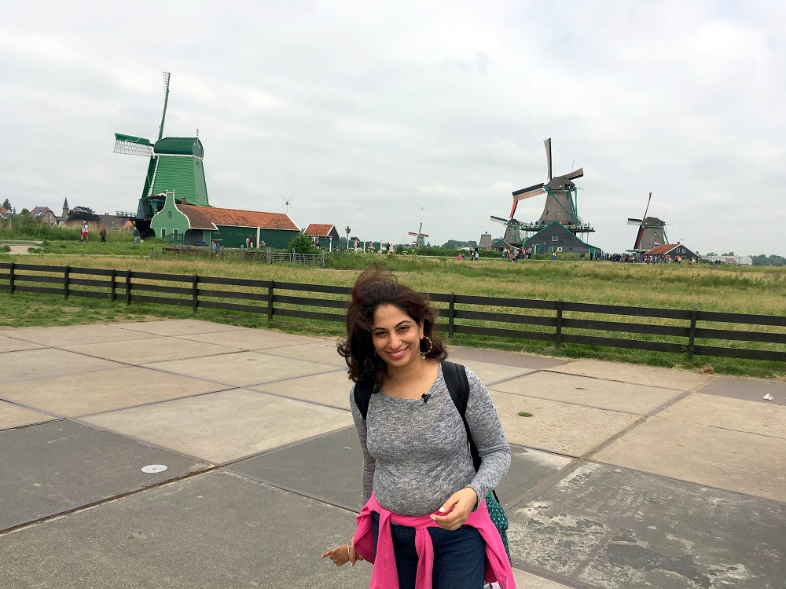
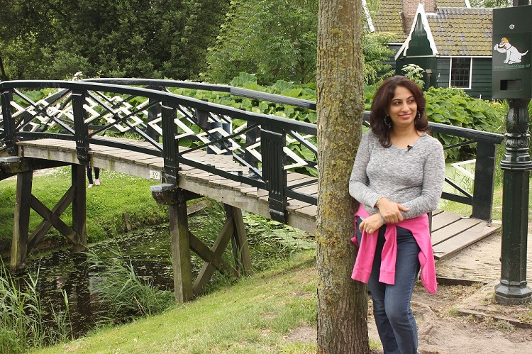
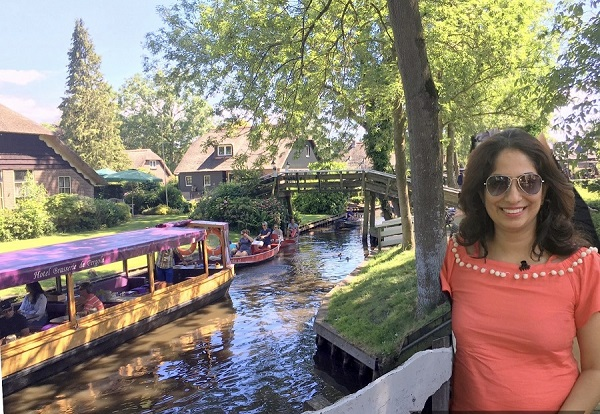

**Instagram:** [@mistytraveldiaries](https://www.instagram.com/mistytraveldiaries/)                
**Homepage:** [Misty Diaries](https://tarunpreetkaur.com/)                
**Back:** [Misty Travel Diaries](https://tarunpreetkaur.com/Misty-Travel-Diaries.html)

**Countries & Cities visited**

* **Netherlands**::Amsterdam, Zaanse Schans, Harleem, Giethoorn 
* **Belgium**::Bruges 
* **Germany**::Cologne, Munich 
* **Austria**::Vienna, Salzburg, Kaprun, Zell am See

**Other details**

* **When:** June, 2017
* **Days:** 13
* **Budget:** INR 92,000 (USD 1,250) per person
   <u>Excluding</u>: Flight Ticket (INR 63,000 return ticket from India), Visa Fees, Shopping
   <u>Including</u>: Hotel / Homestay, Inter & Intra City Travel including train fare, Food, Entry fees
   
   

## Travel Itinerary

**Download Itinerary:**   [Itinerary Europe 2017.pdf](..\assets\pdf\Itinerary Europe 2017.pdf) 

## Photo Blog & trip details

**Begin of Europe Trip**

Arrive at Schiphol Amsterdam airport 

- ·    Buy a metro pass: Buy a metro pass & check if Zaanse Schaans is covered. If you wish to visit Giethoorn (in northern Netherlands) and also Bruges (in Belgium), the easiest way is to hire a car for these 2 days.
- ·    Buy train tickets / hire a cab to the main city: Train tickets cost 5.40€ and it takes around 20 minutes to reach the downtown area. Taxi costs 39€ & takes roughly the same time.

**Netherlands::Amsterdam**

Amsterdam Central: Amsterdam is the Netherlands’ capital, known for its artistic heritage, elaborate canal system and narrow houses with gabled fronts. Cycling is key to the city’s character, and there are numerous bike paths & one can see all varieties of cyclists. If you love cycling, getting a cycle on rent is possible. It's Museum District houses the Van Gogh Museum & the famous Rijksmuseum. Also try a ferry ride. Visiting a beach can be done while coming back from Giethoorn (easier by car).

|  |  |
| :----------------------------------------------------------- | ------------------------------------------------------------ |
|  |  |
|  |  |

**Netherlands::Zaanse Schans (The city of Windmills)**

Zaanse Schans is a neighborhood in the Dutch town of Zaandam, near Amsterdam. Can be reached via a train (a day trip). It is the Historic windmills city of Netherlands and has distinctive green wooden houses, which were relocated here to recreate the look of an 18th/19th-century village. But most of all, it is about a couple of hours of walk in this splendid village!!! You can check out a cheese factory and buy some fresh cheese if you like. You can also checkout the Zaans Museum if there is enough time at hand (famous for regional costumes, model windmills, chocolate & cheese making, handicrafts).

|  |  |
| :----------------------------------------------------------- | :----------------------------------------------------------- |
|  |  |
|  |  |
|  |  |
|  |  |

**Netherlands::Harleem**

|  |  |
| :----------------------------------------------------------- | :----------------------------------------------------------- |
|  |  |
|  |  |
|  |  |

**Netherlands::Giethoorn**

|  |  |
| ------------------------------------------------------------ | ------------------------------------------------------------ |
|  |  |
|  |  |

**Belgium::Bruges (Brugge)** 

| .JPG) |  |
| ------------------------------------------------------------ | ------------------------------------------------------------ |
|  | .JPG) |
| .JPG) | .JPG) |

**Germany::Cologne (Koln)**

| .JPG) |  |
| ------------------------------------------------------------ | ------------------------------------------------------------ |
| .JPG) | .JPG) |
|  | .JPG) |
| .JPG) | .JPG) |

**Austria::Vienna (Wien)::Heart of the city**

| .JPG) | .JPG) |
| ------------------------------------------------------------ | ------------------------------------------------------------ |
| .JPG) | .JPG) |
| .JPG) | .JPG) |
| .JPG) | .JPG) |
| .JPG) | .JPG) |
| .JPG) | .JPG) |
| .JPG) | .JPG) |
| .JPG) | .JPG) |
| .JPG) | .JPG) |
| .JPG) | .JPG) |

**Austria::Vienna (Wien)::Schonbrunn - Zoo, Palace & Gardens**

| .JPG) | .JPG) |
| ------------------------------------------------------------ | ------------------------------------------------------------ |
| .JPG) | .JPG) |
| .JPG) | .JPG) |
| .JPG) | .JPG) |
| .JPG) | .JPG) |

**Germany::Munich (Munchen)**

| .JPG) | .JPG) |
| ------------------------------------------------------------ | ------------------------------------------------------------ |
| .JPG) | .JPG) |
| .JPG) | .JPG) |
| .JPG) | .JPG) |
| .JPG) | .JPG) |
| .JPG) | .JPG) |

**Austria::Kaprun & Zell am See (Alps)**

| .JPG) | .JPG) |
| ------------------------------------------------------------ | ------------------------------------------------------------ |
| .JPG) | .JPG) |
| .JPG) | .JPG) |
| .JPG) | .JPG) |
| .JPG) | .JPG) |
| .JPG) | .JPG) |
| .JPG) | .JPG) |
| .JPG) | .JPG) |
| .JPG) | .JPG) |
| .JPG) | .JPG) |

**Austria::Salzburg**

| .JPG) | .JPG) |
| ------------------------------------------------------------ | ------------------------------------------------------------ |
| .JPG) | .JPG) |
| .JPG) | .JPG) |
| .JPG) | .JPG) |
| .JPG) | .JPG) |
| .JPG) | .JPG) |
| .JPG) | .JPG) |
| .JPG) | .JPG) |

## Video Blog

