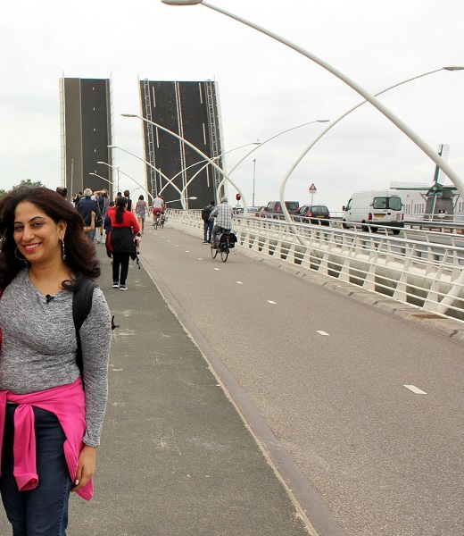
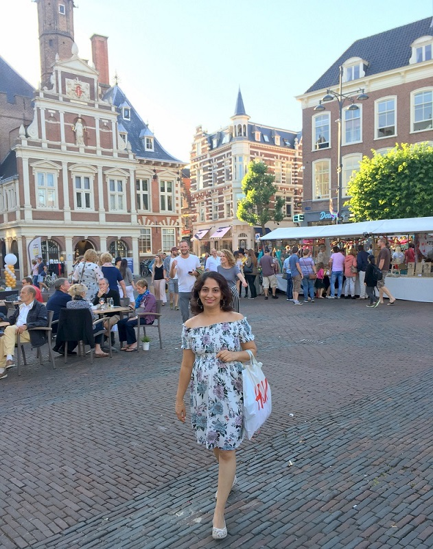
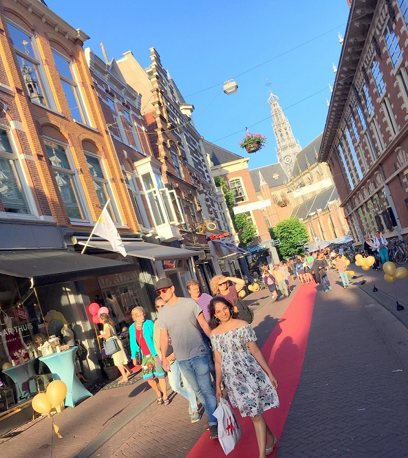
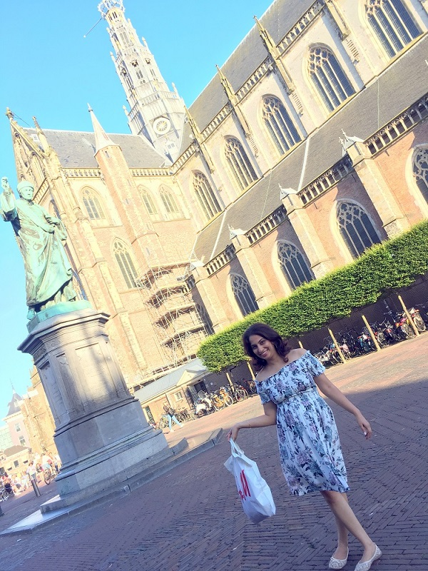
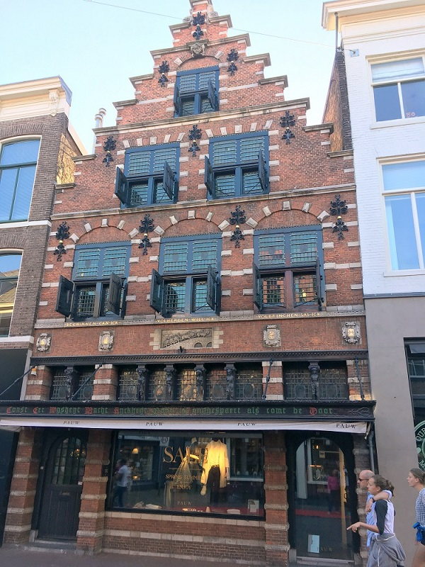

**Instagram:** [@mistytraveldiaries](https://www.instagram.com/mistytraveldiaries/)                
**Homepage:** [Misty Diaries](https://tarunpreetkaur.com/)                
**Back:** [Misty Travel Diaries](https://tarunpreetkaur.com/Misty-Travel-Diaries.html)

**Countries & Cities visited**

* **Netherlands**::Amsterdam, Zaanse Schans, Harleem, Giethoorn 
* **Belgium**::Bruges 
* **Germany**::Cologne, Munich 
* **Austria**::Vienna, Salzburg, Kaprun, Zell am See

**Other details**

* **When:** June, 2017

* **Days:** 13

* **Budget:** INR 92,000 (USD 1,250) per person
   <u>Excluding</u>: Flight Ticket (INR 63,000 return ticket from India), Visa Fees, Shopping
   <u>Including</u>: Hotel / Homestay, Inter & Intra City Travel including train fare, Food, Entry fees

* **What I missed but highly recommend**
   <u>Netherlands::Amsterdam::Keukenhof Gardens and Tulip Fields</u>:: A day trip from Amsterdam, Keukenhof's flower gardens are only open for two months in spring – end March (around the 20th) to mid-May. During this period, Keukenhof is open daily from 8 am to 7:30 pm. Checkout the [link](https://www.youtube.com/watch?v=9LWGdb2e8sY)
   
   <u>Germany::Munich::Neuschwanstein Castle</u>: A day trip from Munich to Neuschwanstein Castle will be an awesome experience. Hop on a train from Hauptbahnhof station to Füssen station. The journey takes approximately 2.5 hours. The regional train leaves every hour throughout the day.

## Travel Itinerary

**Download Itinerary:**   [Itinerary Europe 2017.pdf](..\assets\pdf\Itinerary Europe 2017.pdf) 

## Photo Blog & trip details

**Begin of Europe Trip**

Arrive at Schiphol Amsterdam airport 

- ·    Buy a metro pass: Buy a metro pass & check if Zaanse Schaans is covered. If you wish to visit Giethoorn (in northern Netherlands) and also Bruges (in Belgium), the easiest way is to hire a car for these 2 days.
- ·    Buy train tickets / hire a cab to the main city: Train tickets cost 5.40€ and it takes around 20 minutes to reach the downtown area. Taxi costs 39€ & takes roughly the same time.

**Netherlands::Amsterdam**

Amsterdam Central: Amsterdam is the Netherlands’ capital, known for its artistic heritage, elaborate canal system and narrow houses with gabled fronts. Cycling is key to the city’s character, and there are numerous bike paths & one can see all varieties of cyclists. If you love cycling, getting a cycle on rent is possible. It's Museum District houses the *Van Gogh Museum* & the famous *Rijksmuseum*. Walk around & take a tram once in a while for a few hours at the Centraal and see *Anne Frank House*, *The Jordaan*, *Dutch National Opera & Ballet*, *Royal Palace*, *Vondel park*. Also try a ferry ride. Visiting a beach can be done while coming back from Giethoorn (easier by car). *De Wallen*, Amsterdam's red-light district, is internationally known and one of the main tourist attractions of the city. It offers legal prostitution and a number of coffee shops that sell marijuana.

|  |  |
| :----------------------------------------------------------- | ------------------------------------------------------------ |
|  |  |
|  |  |

**Netherlands::Zaanse Schans**
**(The city of Windmills)**

Zaanse Schans is a neighbourhood in the Dutch town of Zaandam, near Amsterdam. Can be reached via a train (a day trip). It is the Historic windmills city of Netherlands and has distinctive green wooden houses, which were relocated here to recreate the look of an 18th/19th-century village. But most of all, it is about a couple of hours of walk in this splendid village!!! You can check out a cheese factory and buy some fresh cheese if you like. You can also checkout the Zaans Museum if there is enough time at hand (famous for regional costumes, model windmills, chocolate & cheese making, handicrafts).

|  |  |
| :----------------------------------------------------------- | :----------------------------------------------------------- |
|  |  |
|  |  |
|  |  |
|  |  |

**Netherlands::Harleem**

Haarlem is a city in the outskirts of Amsterdam. Once a major North Sea trading port, it retains its medieval character of cobblestone streets and gabled houses. It's the centre of a major flower-bulb-growing district, and famous for its outlying tulip fields and hofjes (almshouses built around leafy courtyards).

|  |  |
| :----------------------------------------------------------- | :----------------------------------------------------------- |
|  |  |
|  |  |
|  |  |

**Netherlands::Giethoorn**
**(The Venice of Netherlands)**

A day trip from Amsterdam (approach: Rented Car). Giethoorn is a mostly car-free village in the northeastern Netherlands. It’s known for its boat-filled waterways & the way to step out of the house is usually a boat or a cute bridge. There are centuries-old thatched-roof houses. Difficult to reach, but it is cuteness overloaded!!!

|  |  |
| ------------------------------------------------------------ | ------------------------------------------------------------ |
|  |  |
|  |  |

**Belgium::Bruges (Brugge)** 
Bruges is a famous city in Belgium & is distinguished by its canals, cobbled streets and medieval buildings. In the city centre's *Burg square*, the 14th-century *Stadhuis (City Hall)*. A couple of hours of walk in Brugge is good fun. Don't forget to try Belgian chocolate and Belgian waffles while in Belgium.

|  |  |
| ------------------------------------------------------------ | ------------------------------------------------------------ |
|  | .JPG) |
| .JPG) | .JPG) |

**Germany::Cologne (Koln)**

Stop over for a few hours at Cologne, during your journey from Amsterdam to Vienna. Why travel during day when the train journey can be covered at night! Cologne, a 2,000-year-old city spanning the *Rhine River* in western Germany, is the region’s cultural hub. A landmark of High Gothic architecture set amid reconstructed old town, the twin-spired *Cologne Cathedral* is also known for its gilded medieval setting and sweeping river views. The Cathedral and the *Hohenzollern Bridge* are both just next to the train station. Keep the luggage at the station in a locker for a few hours & enjoy the beautiful city. 
If interested, you can also visit the adjacent *Museum Ludwig* showcases 20th-century art, including many masterpieces by Picasso, and the *Romano-Germanic Museum* houses Roman antiquities.

| .JPG) |  |
| ------------------------------------------------------------ | ------------------------------------------------------------ |
| .JPG) | .JPG) |
|  | .JPG) |
| .JPG) | .JPG) |

**Austria::Vienna (Wien)::Belvedere Palace & Stephansplatz**
The morning can be spent to checkout the beautiful Belvedere Palace and it's gardens.
After that you can walk & cover so many beautiful buildings in & around Stephansplatz (geographical centre of Vienna). The list is never ending, but here are a top few - St. Stephen’s Cathedral (Stephansdom), Hofburg Palace, Rathausplatz (City Hall), Austrian Parliament, Kunsthistorisches Museum, Vienna State Opera House (Staatsoper), Karlskirche.

| .JPG) | .JPG) |
| ------------------------------------------------------------ | ------------------------------------------------------------ |
| .JPG) | .JPG) |
| .JPG) | .JPG) |
| .JPG) | .JPG) |
| .JPG) | .JPG) |
| .JPG) | .JPG) |
| .JPG) | .JPG) |
| .JPG) | .JPG) |
| .JPG) | .JPG) |
| .JPG) | .JPG) |

**Austria::Vienna (Wien)::Schonbrunn**

Schonbrunn - Zoo, Palace & Garden
The spectacular 1,441 rooms Schönbrunn Palace (Schloss Schönbrunn) was built in the early 18th century in a beautiful park-like setting and remains one of Austria's leading attractions. The spectacular park around Schönbrunn Palace covers an area of 500 acres. There is a train running inside the gardens to take you around the gardens which has exceptional sculptures throughout the way. Tiergarten Schönbrunn (Schönbrunn Zoo) the oldest zoo in the world and is a home to all kinds of animals including a giant Panda and lovely Penguins.

| .JPG) |  |
| ------------------------------------------------------------ | ------------------------------------------------------------ |
| .JPG) | .JPG) |
| .JPG) | .JPG) |
| .JPG) | .JPG) |
| .JPG) | .JPG) |

**Germany::Munich (Munchen)**

Munich, Bavaria’s capital, is home to centuries-old buildings and numerous museums. The city is known for its annual Oktoberfest celebration and its beer halls, including the famed *Hofbräuhaus*, founded in 1589. In the Altstadt (Old Town), central Marienplatz square contains landmarks such as Neo-Gothic *Neues Rathaus* (town hall), with a popular show that re-enacts stories from the 16th century. Close by attractions are - *Peterskirche* (St. Peter's Church), *Asamkirche*, *Frauenkirche*, *Munich Residenz*, *Hofbräuhaus* and *Viktualienmarkt* (Flea Market). Evenings are best spent at the *English Gardens*. Don't forget to carry a costume for swim in the river.
Another day can be spent at *Deutsches (Science) Museum*.

| .JPG) | .JPG) |
| ------------------------------------------------------------ | ------------------------------------------------------------ |
| .JPG) | .JPG) |
| .JPG) | .JPG) |
| .JPG) | .JPG) |
| .JPG) | .JPG) |
| .JPG) | .JPG) |

Leave most of the luggage at your Munich hotel and make a last 3-days trip to see Austrian Alps and Salzburg.

**Austria::Kaprun & Zell am See (Alps)**
Zell am See is an Austrian town on Lake Zell, south of the city of Salzburg. Here you will find a crystal clear lake, snow covered meadows *and* the eternal ice of the glacier. Trails and lifts lead to the ski slopes of *Schmittenhöhe* mountain. Southwest, views from Gipfelwelt 3000 panoramic platform, at the top of the *Kitzsteinhorn glacier*, take in *Hohe Tauern National Park* and the looming *Grossglockner* mountain. 

| .JPG) | .JPG) |
| ------------------------------------------------------------ | ------------------------------------------------------------ |
| .JPG) | .JPG) |
| .JPG) | .JPG) |
| .JPG) | .JPG) |
| .JPG) | .JPG) |
| .JPG) | .JPG) |
| .JPG) | .JPG) |
| .JPG) | .JPG) |
| .JPG) | .JPG) |
| .JPG) | .JPG) |

**Austria::Salzburg**
Take a morning train from Zell am See to Munich & stop over at Salzburg for 7 or 8 hours. Leave excess luggage at the train station. Salzburg is an Austrian city on the border of Germany, with views of the Eastern Alps. The city is divided by the Salzach River, with medieval and baroque buildings of the pedestrian *Altstadt* (Old City) on its left bank, facing the 19th-century *Neustadt* (New City) on its right. The Altstadt birthplace of famed composer Mozart is preserved as a museum displaying his childhood instruments, known as *Mozart-Geburtshaus*. In the 1960s, the movie *The Sound of Music* used some locations in and around Salzburg. The song “*Do*-*Re*-*Mi*” was filmed in the Mirabell Gardens and *Fortress Hohensalzburg* in Salzburg. 
You can start your tour at Mirabell Palace. From Mirabel you can walk out into *Makartplatz*, turn right past the *Landestheater* and then cross the river by the *Makartsteg* footbridge (love lock bridge). This will take you into the old city. If you have a city map just head for *Domplatz* (cathedral square) or *Residenzplatz*. In *Residenzplatz* there is the horse fountain dating from the 17th century. Also closeby are *Getreidegasse* & *St Peter's Abbey*.

| .JPG) | .JPG) |
| ------------------------------------------------------------ | ------------------------------------------------------------ |
| .JPG) | .JPG) |
| .JPG) | .JPG) |
| .JPG) | .JPG) |
| .JPG) | .JPG) |
| .JPG) | .JPG) |
| .JPG) | .JPG) |
| .JPG) | .JPG) |

Upon reaching Munich pickup the remaining luggage from the hotel and proceed to the Munich International airport.

## Video Blog

To be updated soon!

