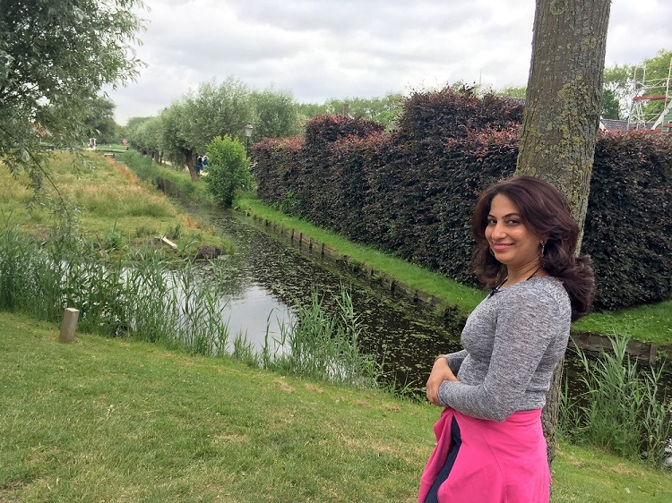
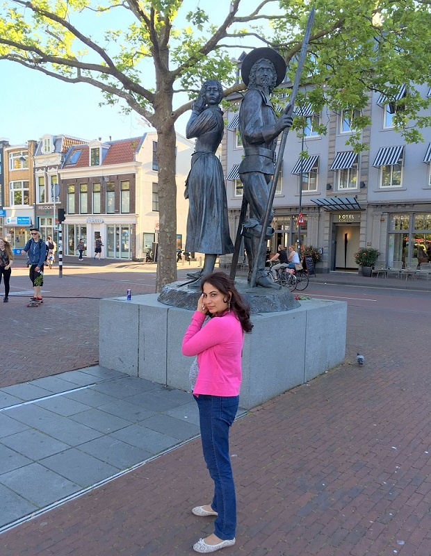

---

layout: post
title: Misty Travel Diaries - Europe, 2017
subtitle: Netherlands, Belgium, Germany, Austria
gh-repo: daattali/beautiful-jekyll
gh-badge: [star, fork, follow]
tags: [test]
comments: true
---

**Instagram:** [@mistytraveldiaries](https://www.instagram.com/mistytraveldiaries/)

**Countries & Cities visited**

* **Netherlands**::Amsterdam, Zaanse Schans, Harleem, Giethoorn 
* **Belgium**::Bruges 
* **Germany**::Cologne, Munich 
* **Austria**::Vienna, Salzburg, Kaprun, Zell am See

**Other details**

* **When:** June, 2017
* **Days:** 13
* **Budget:** 
* **Download Itinerary:**   [Itinerary Europe 2017.pdf](..\assets\pdf\Itinerary Europe 2017.pdf) 

## Photo Blog

**Netherlands::Amsterdam**

|  |  |
| :------ | ------- |
|  |  |
|  |  |

**Netherlands::Zaanse Schans**

|  |  |
| :----------------------------------------------------------- | :----------------------------------------------------------- |
|  |  |
|  |  |
|  |  |
|  |  |

<iframe height='265' scrolling='no' title='Fancy Animated SVG Menu' src='//codepen.io/jeangontijo/embed/OxVywj/?height=265&theme-id=0&default-tab=css,result&embed-version=2' frameborder='no' allowtransparency='true' allowfullscreen='true' style='width: 100%;'>See the Pen <a href='https://codepen.io/jeangontijo/pen/OxVywj/'>Fancy Animated SVG Menu</a> by Jean Gontijo (<a href='https://codepen.io/jeangontijo'>@jeangontijo</a>) on <a href='https://codepen.io'>CodePen</a>. </iframe>

**Netherlands::Harleem**

|  |  |
| :----------------------------------------------------------- | :----------------------------------------------------------- |
|  |  |
|  |  |
|  |  |

**Netherlands::Giethoorn**

|  |  |
| ------------------------------------------------------------ | ------------------------------------------------------------ |
|  |  |
|  |  |
|                                                              |                                                              |
|                                                              |                                                              |
|                                                              |                                                              |
|                                                              |                                                              |
|                                                              |                                                              |

|             |                    |      |      |
| :---------- | :----------------- | ---- | ---- |
| Netherlands | Giethoor           |      |      |
| Belgium     | Bruges             |      |      |
| Germany     | Cologne            |      |      |
| Germany     | Munich             |      |      |
| Austria     | Vienna             |      |      |
| Austria     | Salzburg           |      |      |
| Austria     | Kaprun (Alps)      |      |      |
| Austria     | Zell am See (Alps) |      |      |

## Video Blog

