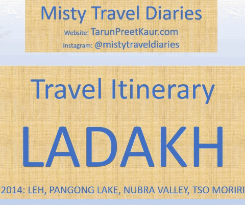

**Instagram:** [@mistytraveldiaries](https://www.instagram.com/mistytraveldiaries/)                
**Homepage:** [Misty Diaries](https://tarunpreetkaur.com/)                
**Back:** [Misty Travel Diaries](https://tarunpreetkaur.com/Misty-Travel-Diaries.html)

**Cities visited**

* **Leh** <u>Leh</u>:
Leh Palace **■** Leh **■** Leh local markets
  <u>West of Leh</u>:
  Chilling village **■** Alchi Monastery **■** Magnetic Hill **■** Gurudwara Shri Pathar Sahib **■**  Sangam of rivers Zanskar & Indus
  <u>East of Leh</u>:
  Holy Fish Pond @ Shey Palace **■** Shey Palace **■** Druk Padma Karpo School (of 3-Idiots fame) **■** Thiksey Monsatery
**■** Hemis Monsatery
* **Pangong Lake** (1 day trip from Leh):
  Chang La (Pass) **■** Chagar (White) Tso (Lake) **■** Pangong Lake (Tso Pangong)
* **Nubra Valley & Turtuk** (3 days trip from Leh)
  Khardung La (Pass) **■** Panamik Hot Spring along Nubra river **■** Yarab Tso (Lake) **■** Turtuk Village along Shyok River (1 day trip from Nubra Valley) **■** Two Humped Camels **■** Diskit Monastry **■** Sandunes **■** Trek down to Shyok Riverside
* **Tso Moriri** (2 days trip from Leh):
  Lovely landscape near Sumda **■** Cute Broken Bridge **■** Kyagar Tso (Lake) **■** Tso (Lake) Moriri **■** Tso (Lake) Kar **■** Taglang La (Pass)

**Other details**

* **When:** September, 2014
* **Days:** 13
   While we kept the trip very relaxed, the same trip can be manged in 10 days
* **Budget:** INR ??? (USD ??? ) per person
   Inflation of INR from 2014 to current time must be considered
   Rates included are for the Rented car (8 seater) shared by 4 adults
   <u>Excluding</u>: Flight Ticket (INR ??? return ticket), Shopping 
   <u>Including</u>: Hotel, Rented car + Driver + Guide for Inter & Intra City Travel, Food, Entry fees

## Travel Itinerary

**Download Itinerary:**    [Itinerary Ladakh 2014.pdf](..\assets\pdf\Itinerary Ladakh 2014.pdf) 

**Travel Agent:** TT (Mr. Tundup Paljor) ; Instagram: [Tundup Paljor](https://www.instagram.com/paljortundup/) ; Contact: +91 9469448875/9622262062/6005571665

## Photo Blog & trip details

**West of Leh::**Chilling village **■** Alchi Monastery **■** Magnetic Hill **■** Gurudwara Shri Pathar Sahib **■**  Sangam of rivers Zanskar & Indus

| .JPG) | .JPG) |
| :----------------------------------------------------------- | ------------------------------------------------------------ |
| .JPG) | .JPG) |
| .JPG) | .JPG) |
| .JPG) |                                                              |

**East of Leh::**Holy Fish Pond @ Shey Palace **■** Shey Palace **■** Druk Padma Karpo School (of 3-Idiots fame) **■** Thiksey Monsatery

| .JPG) | .JPG) |
| :----------------------------------------------------------- | :----------------------------------------------------------- |
| .JPG) | .JPG) |
| .JPG) |                                                              |
| .JPG) | .JPG) |
| .JPG) | .JPG) |
| .JPG) | .JPG) |

**Pangong Lake::**Chang La (Pass) **■** Chagar (White) Tso (Lake) **■** Pangong Lake (Tso Pangong)

| .JPG) | .JPG) |
| :----------------------------------------------------------- | :----------------------------------------------------------- |
| .JPG) | .JPG) |
| .JPG) | .JPG) |
|                                                              |                                                              |
| .JPG) | .JPG)       |
| .JPG) | .JPG) |
| .JPG) | .JPG) |

**Nubra Valley & Turtuk::** Khardung La (Pass) **■** Panamik Hot Spring along Nubra river **■** Yarab Tso (Lake) **■** Turtuk Village along Shyok River (1 day trip from Nubra Valley) **■** Two Humped Camels **■** Diskit Monastry **■** Sandunes **■** Trek down to Shyok Riverside

|      |      |
| :--- | :--- |
|      |      |
|      |      |
|      |      |

**Paro**

|      |      |
| :--- | :--- |
|      |      |
|      |      |
|      |      |
|      |      |
|      |      |

**Chela La Pass & Haa Valley**

|      |      |
| :--- | :--- |
|      |      |
|      |      |
|      |      |
|      |      |
|      |      |

## Video Blog

