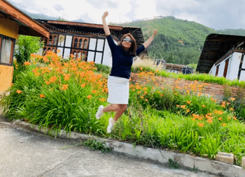

**Instagram:** [@mistytraveldiaries](https://www.instagram.com/mistytraveldiaries/)                
**Homepage:** [Misty Diaries](https://tarunpreetkaur.com/)                
**Back:** [Misty Travel Diaries](https://tarunpreetkaur.com/Misty-Travel-Diaries.html)

**Cities visited**

* **Leh** 
* **Pangong Lake** via Chang La (1 day trip from Leh)
* **Nubra Valley & Turtuk** via Khardung La (3 days trip from Leh) 
* **Tso Moriri** via Taglang La (2 days trip from Leh)

**Other details**

* **When:** September, 2014
* **Days:** 13
   While we kept the trip very relaxed, the same trip can be manged in 10 days
* **Budget:** INR 45,000 (USD 612) per person
   <u>Excluding</u>: Flight Ticket (INR 20,000 return ticket from India), Shopping 
   <u>Including</u>: Hotel, Rented car + Driver + Guide for Inter & Intra City Travel, Food, Entry fees

## Travel Itinerary

**Download Itinerary:**    [Itinerary Ladakh 2014.pdf](..\assets\pdf\Itinerary Ladakh 2014.pdf) 

## Photo Blog & trip details

**Thimphu**

| .gif) |  |
| :----------------------------------------------------------- | ------------------------------------------------------------ |
| .JPG) | .JPG) |
| .JPG) | .JPG) |
| .JPG) | .JPG) |
| .jpg) | .JPG) |
| .JPG) | .JPG) |
| .JPG) | .JPG) |
| .JPG) | .JPG) |
| .JPG) | .JPG) |

**Dochula Pass, Serbithang National Park & Chimi Lhakhang**

| .JPG) | .JPG) |
| :----------------------------------------------------------- | :----------------------------------------------------------- |
| .JPG) | .JPG) |
| .JPG) | .JPG) |
| .JPG) | .JPG) |
| .JPG) | .jpg) |

**Punakha**

| .JPG) | .JPG) |
| :----------------------------------------------------------- | :----------------------------------------------------------- |
| .JPG) | .JPG) |
| .JPG) | .JPG) |
| .JPG) | .JPG) |
| .JPG) | .JPG) |
| .JPG) | .JPG) |

**Phobjikha Valley**

| .JPG) | .JPG) |
| :----------------------------------------------------------- | :----------------------------------------------------------- |
| .JPG) | .JPG) |
| .JPG) | .JPG) |
| .JPG) | .JPG) |

**Paro**

| .JPG)   | .JPG)    |
| :---------------------------------------------------------- | :----------------------------------------------------------- |
| .JPG) | .JPG)    |
| .JPG)   | .JPG)    |
| .JPG)   | .JPG)    |
| .JPG)   | .JPG)    |
| .JPG) |  |

**Chela La Pass & Haa Valley**

| .JPG) | .JPG) |
| :----------------------------------------------------------- | :----------------------------------------------------------- |
| .JPG) | .JPG) |
| .JPG) | .JPG) |
| .JPG) | .JPG) |
| .JPG) | .JPG) |
| .JPG) | .JPG) |

## Video Blog

