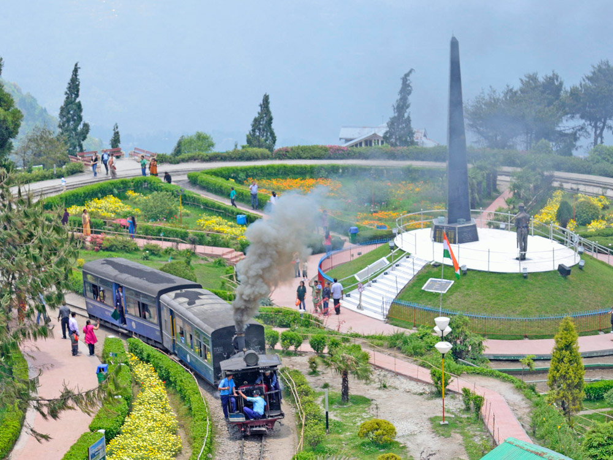
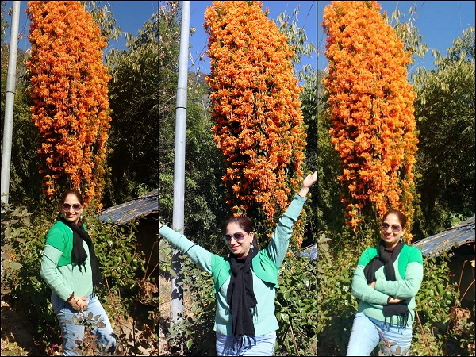

**Links:** [**Instagram**](https://www.instagram.com/mistytraveldiaries/) | [**Misty Diaries**](https://tarunpreetkaur.com/) | [**Misty Travel Diaries**](https://tarunpreetkaur.com/Misty-Travel-Diaries.html)

## Trip details

**Cities visited**

* **West Bangal::Darjeeling** 
Tiger Hill **■** Batasia Loop **■** Tenzing & Gombu Rock **■** Himalayan Mountaineering Institute (HMI)  **■** Padmaja Naidu Himalayan Zoo **■** Ranjeet Tea Garden **■** Japanese Peace Pagoda **■** Tibetan Refugee Camp  **■** Gangamaya Park & Rock Garden **■** Happy Valley Tea Garden  **■**  Chaurasta (Local Market)
* **Sikkim::Gangtok**  
  Changu Lake (Tsomgo) **■** Baba Harbhajan Singh Mandir **■** NathuLa **■** Rumtek Monsatery **■** Namgyal Institute of Tibetology  **■** Ropeway Cable Ride **■** Ranka Monastery **■** Sikkim Paragliding **■** Banjakhari Waterfalls **■** Tashi View Point **■** Hanuman Tok **■** MG Road
* **Sikkim::Namchi & Ravangla**  (en-route Gangtok to Tashiding)  
  Tarey Bhir Namchi **■** Char Dham Namchi **■**  Temi Tea Gardens **■** Tathagata Tsal (Ravangla Buddha Park)
* **Sikkim::Tashiding** 
  Coronation Place **■** Bonfire, local wine, dine dance at our Guide's home **■** Tashiding Monsatary Trek **■** Riverside Picnic (Music, Karaoke, Beer & Food arranged by our Guide)
* **Sikkim::Pelling** 
  Kanchenjunga Waterfalls **■** Khecheopalri Lake & Trek **■** Kanchenjunga sunrise **■** Dantem Valley **■** Singashore Bridge **■** Sangacholi Skywalk **■** Orange Gardens

**Other details**

* **When:** December, 2018
* **Days:** 10
* **Budget:** To be updated

**What I missed but recommend (if spare time)**

* <u>Kalimpong</u> (West Bengal) day trip from Darjeeling - Pine View Nursery **■** Durpin Monastery **■** Mangal Dham **■** Deolo Hill **■** Lord Buddha Statue **■** Tista and Rangit river view point and Lamahatta
* Lava (West Bengal) day trip from Darjeeling
* Neora Valley National Park (1 or 2 more spare days)
* <u>Darjeeling</u>::Steam engine Train ride  **■**  Darjeeling Ropeway **■**  Old Ghoom Monastery
* <u>Gangtok</u>::Rumtek Monastery  **■**  Nathang Valley (during Changu Lake/Baba mandir/NathuLa trip)  **■**  Lachung, Yumthang, Gurudongmar Lake, Cholamu (Tso Lhamo) Lake (3 days trip)

## Travel Itinerary

**Download Itinerary:**    [Itinerary Darjeeling & Sikkim 2018.pdf](..\assets\pdf\Itinerary Darjeeling & Sikkim 2018.pdf) 

**Travel Agent:** Mr. Phurba Gunss (Connecting Northeast) ; [Instagram](https://www.instagram.com/connectingnortheast/) ; [Facebook](https://www.facebook.com/ConnectingNortheast/)  ; [Website](http://www.connectingnortheast.com/) ; Contact: +91 83720 38491

## Photo Blog & trip details

**Darjeeling::**Tiger Hill **■** Batasia Loop **■** Tenzing & Gombu Rock **■** Himalayan Mountaineering Institute (HMI)  **■** Padmaja Naidu Himalayan Zoo **■** Ranjeet Tea Garden **■** Japanese Peace Pagoda **■** Tibetan Refugee Camp  **■** Gangamaya Park & Rock Garden **■** Happy Valley Tea Garden  **■**  Chaurasta (Local Market) 

| .JPG) |  |
| :----------------------------------------------------------- | ------------------------------------------------------------ |
| .JPG) | .JPG) |
| .JPG) | .jpg) |
| .jpg) | .JPG) |
|  | .JPG) |
| .JPG) | .JPG) |

**Gangtok::**Changu Lake (Tsomgo) **■** Baba Harbhajan Singh Mandir **■** Rumtek Monsatery **■** Namgyal Institute of Tibetology  **■** Ropeway Cable Ride **■** Ranka Monastery **■** Sikkim Paragliding **■** Banjakhari Waterfalls **■** Tashi View Point **■** Hanuman Tok **■** MG Road 

| .JPG)` |  |
| :----------------------------------------------------------- | ------------------------------------------------------------ |
| .JPG) |  |
| .JPG) | .JPG) |
| .JPG) | .JPG) |
| .JPG) | .JPG) |
| .JPG) | .JPG) |
|  | .JPG) |
| .JPG) |  |

**Changu Lake, Baba Mandir & Nathu La** Day trip from Gangtok::Tsomgo (Changu) Lake (40 KMs) **■** Baba Mandir  **■** Nathu La Pass (56 km) & **■** Nathang Valley (77Kms)

| .JPG) | .JPG) |
| :----------------------------------------------------------- | ------------------------------------------------------------ |
| .JPG) | .JPG) |
| .JPG) | .JPG) |
| .JPG) | .JPG) |
| .JPG) | .JPG) |
| .JPG) |  |
| .JPG) | .JPG) |
|  | .JPG) |
| .JPG) | .JPG) |
| .JPG) | .JPG) |

**Namchi & Ravangla** (en-route Gangtok to Tashiding)::Tarey Bhir Namchi **■** Char Dham Namchi **■**  Temi Tea Gardens **■** Tathagata Tsal (Ravangla Buddha Park). We were caught in unexpected snowfall. It was beautiful and scary at the same time. Unfortunately we could not reach Ravangla Buddha Gardens and had to skip it. Some pics from Internet of the same. 

| .JPG) | .JPG) |
| :----------------------------------------------------------- | ------------------------------------------------------------ |
| .JPG) | .jpeg) |
| .JPG) | .JPG) |
| .JPG) | .JPG) |
| .JPG) |  |
|  |  |

**Pelling::**Kanchenjunga Waterfalls **■** Khecheopalri Lake & Trek **■** Kanchenjunga sunrise **■** Dantem Valley **■** Singashore Bridge **■** Sangacholi Skywalk **■** Orange Gardens

| .JPG) | .JPG) |
| :----------------------------------------------------------- | ------------------------------------------------------------ |
| .JPG) | .JPG) |
| .JPG) | .JPG) |
| .JPG) | .JPG) |
| .JPG) |  |
| .JPG) | .JPG) |
| .JPG) | .JPG) |
| .JPG) | .JPG) |
|  | .JPG) |
|  (7).JPG) |  (8).JPG) |
|  (23).JPG) |  (24).JPG) |
| .JPG) | .JPG) |

**Tashiding::**Coronation Place **■** Bonfire, local wine, dine dance at our Guide's home **■** Tashiding Monsatary Trek **■** Riverside Picnic (Music, Karaoke, Beer & Food arranged by our Guide)

| .JPG) | .JPG) |
| :----------------------------------------------------------- | ------------------------------------------------------------ |
| .JPG) | .JPG) |
| .JPG) | .JPG) |
| .JPG) | .JPG) |
| .JPG) |  Tashiding SS (TashidingMonsataryTrek, Riverside picnic) (8).JPG) |
|  Tashiding SS (TashidingMonsataryTrek, Riverside picnic) (3).JPG) |  Tashiding SS (TashidingMonsataryTrek, Riverside picnic) (5).JPG) |
|  Tashiding SS (TashidingMonsataryTrek, Riverside picnic) (4).JPG) |  Tashiding SS (TashidingMonsataryTrek, Riverside picnic) (6).JPG) |
|  Tashiding SS (TashidingMonsataryTrek, Riverside picnic) (7).JPG) |  Tashiding SS (TashidingMonsataryTrek, Riverside picnic) (9).JPG) |
| .JPG) | .JPG) |
|  Tashiding SS (TashidingMonsataryTrek, Riverside picnic) (12).JPG) | .JPG) |

## Video Blog

