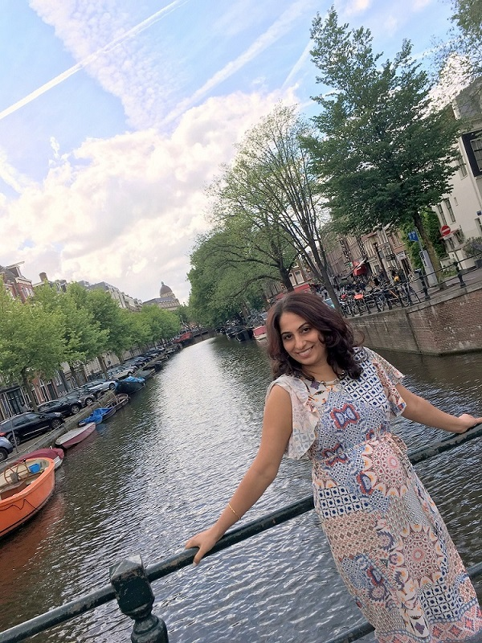

Hi, My name is Tarunpreet Kaur and I am from New Delhi, India. I love travel, photography, fashion & learning various dance forms. Some of my dance & dress-up photo & video shoots are available at @ [Misty Bolly Dances](https://tarunpreetkaur.com/Misty-Bolly-Dances.html) & [Misty DressUp Diaries](https://tarunpreetkaur.com/Misty-DressUp-Diaries.html)

Over the past years, I have visited so many beautiful places. I am an organized person & I prepare my travel plans very carefully. Sharing some of my detailed itineraries with you @ [Misty Travel Diaries](https://tarunpreetkaur.com/Misty-Travel-Diaries.html). I am sure this site will help you plan some of your exotic holidays in an easier manner :) Do take a minute to check it out!

**My Story**

| **`Mahi Mera - Kithe Reh Gya`**  [ | **`Kurta Pajama Kala`**    |
| ------------------------------------------------------------ | ------------------------------------------------------------ |
| .JPG) | .JPG) |
| .JPG) |  |
|  | .JPG) |
| .JPG) | .JPG) |
| .JPG) | .JPG) |
|  |  |
| .JPG) |  |
|  |  |
| .JPG) |  |
|  | .JPG) |
| .JPG) | .JPG) |
| .JPG) | .JPG) |
| .JPG) | .JPG) |

